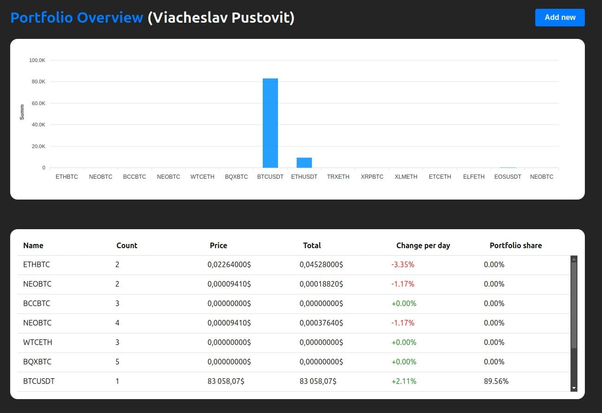
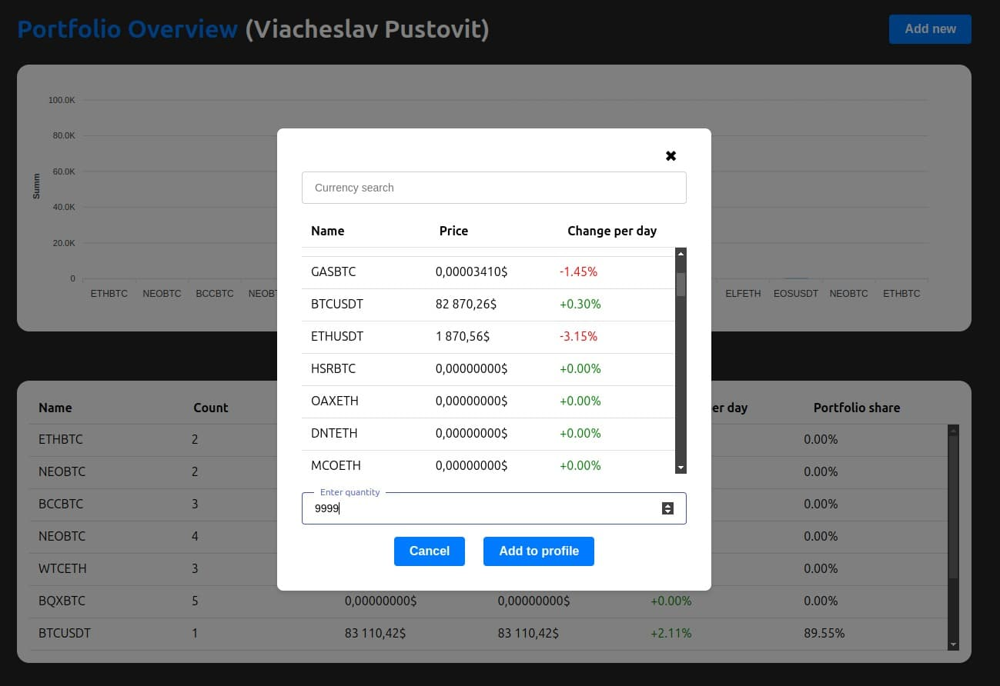

# 🎬 Portfolio Overview (VIACHESLAV PUSTOVIT)

## 🛠️ Project description

This is an administrative dashboard for asset management. The application allows you to add and remove assets to a portfolio, obtain analytical data using graphs, and update data in real time.

## 🚀 Functionality

- 🔹 Adding, editing, and deleting categories
- 🔹 Managing subcategories for each category
- 🔹 User-friendly interface with dynamic data updates
- 🔹 Form validation for correct data entry

## 🧰 Technologies Used

- ⚛️ React + Vite
- ⚙️ TypeScript
- 🗂️ Redux/ReduxToolkit
- 🎨 Module Sass
- 📊 ApexCharts

## ⚙️ Installation and launch

1. Clone the repository:

   ```bash
   git clone https://github.com/gitslava92/matrix-test.git
   cd matrix-test

   ```

2. Install the dependencies:

   ```bash
   npm install

   ```

3. Launch the project:

   ```bash
   npm run dev

   ```

4. Key directories:

- `/app/` — Application entry point and providers
- `/pages/` — Individual pages with dynamic routing
- `/features/` — Independent functionality modules
- `/entities/` — Core business models
- `/shared/` — Common utilities, UI components, and hooks

  

  
